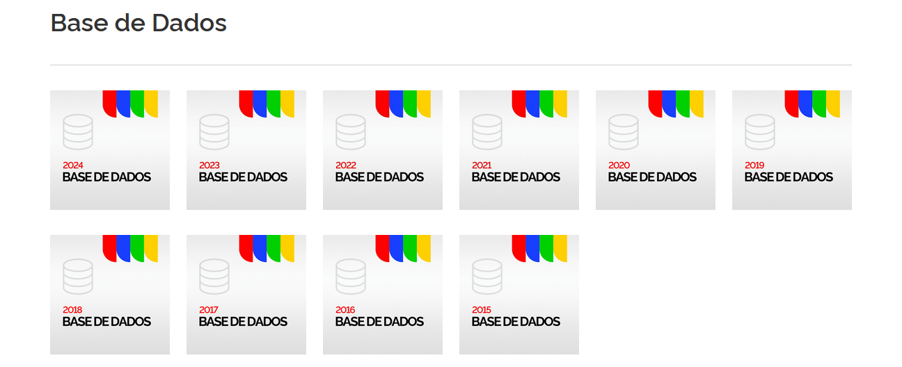

# Steps

## 00 - Base de dados

Pegamos os dados do [SINESP](https://www.gov.br/mj/pt-br/assuntos/sua-seguranca/seguranca-publica/estatistica/dados-nacionais-1/base-de-dados-e-notas-metodologicas-dos-gestores-estaduais-sinesp-vde-2022-e-2023)

Eles vão de 2015 até 2024, com diversos eventos (roubo, arma apreendida, apreensão de drogas, lesão corporal, acidente de trânsito, feminicídio...)

Colunas:
- uf              (estado onde ocorreu)
- municipio       (cidade onde ocorreu)
- evento          (roubo, arma apreendida, apreensão de drogas, feminicídio...)
- data_referencia (data do acontecido)
- agente          (militar, civil, bombeiros, PRF)
- arma            (fuzil, pistola, rifle)
- faixa_etaria    (maior ou menor de idade)
- feminino        (total de vítimas do gênero feminino)
- masculino       (total de vítimas do gênero masculino)
- nao_informado   (total de vítimas com gênero não informado)
- total           (informado quando é apreensão de armas)
- total_peso      (informado quando é apreensão de drogas)
- abrangencia     (Estadual)
- formulario      (1, 2, 3, 4...)
- total_vitimas   (soma das colunas -> feminino + masculino + nao_informado)

Vamos pegar apenas os registros com evento=Feminicídio e feminino>0

As colunas relevantes serão:
- uf              (uf)
- data_referencia (data)
- feminino        (vitimas)

Assim vamos pegar cada arquivo e deixar apenas essas 3 colunas em cada um.

Análise de feminicídios [PowerBI](https://app.powerbi.com/view?r=eyJrIjoiZWUwOWJhYmYtZjAzNi00ZmRkLWJlZmMtODQ3NjdlZmZjNTZlIiwidCI6ImViMDkwNDIwLTQ0NGMtNDNmNy05MWYyLTRiOGRhNmJmZThlMSJ9)

